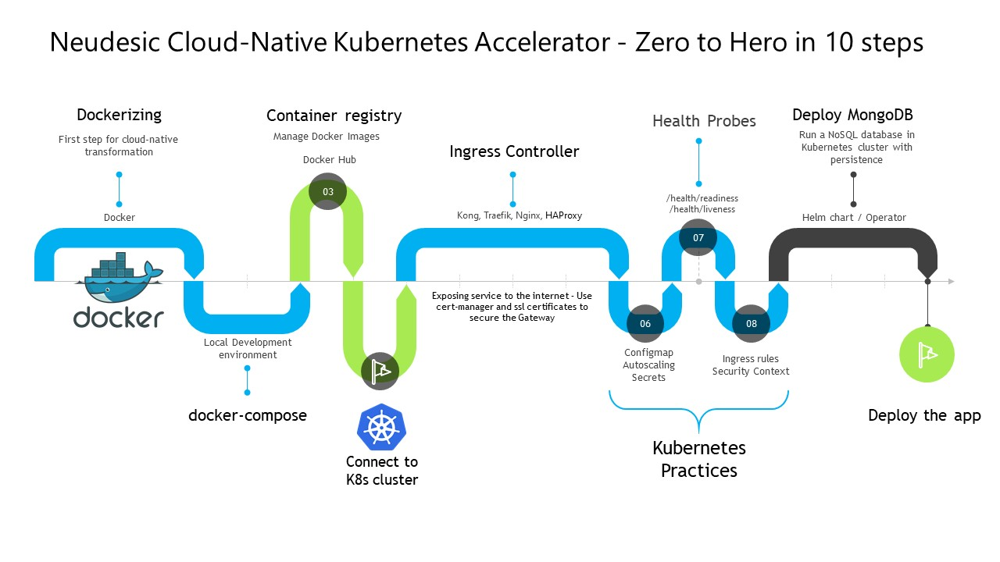

# Neudesic Cloud-Native Kubernetes Accelerator - Zero to Hero in 10 steps

If you ever wondered how to get your hands dirty with Kubernetes - Well, fret no more! Here we are introducing a Kubernetes zero to hero exercise which enables you to start from code base to all the way to Kubernetes deployment based on best practices. The app-mod accelertor provides you necessary application and accelerators for deploying to the Kubernetes cluster.

The final goal of this exercise is to deploy a .net core web api application with a Mongo DB to the Kubernetes cluster using the accelerators provied by the app-mod initiative.



### Prerequisite
- Neudesic cloud-transformation repo (https://github.com/cloud-transformation/ct-bootcamp-project)
- A Kubernetes cluster (Minikube, k3s, Kubernetes on Docker Desktop or any cloud provided cluster)
- Docker daemon running in your machine
- Access to any Docker registry (Dockerhub)

## Steps to follow

- [Dockerizing the .net core application](#1.-Dockerizing-the-.net-core-application)
- [Use docker-compose to setup local development environment](#2.-Use-docker-compose-to-setup-local-development-environment)
- [Push Docker Image to the Container registry](#3.-Push-Docker-Image-to-the-Container-registry)
- [Connect to the kubernetes cluster](#4.-Connect-to-the-kubernetes-cluster)
- [Setup Traefik Ingress controller](#5.-Setup-Traefik-Ingress-controller)
- [Enable Health probes for Pod lifecycle management](#6.-Enable-Health-probes-for-Pod-lifecycle-management)
- [Setup Kubernetes secrets for sensitive-configurations](#7.-Setup-Kubernetes-secrets-for-sensitive-configurations)
- [Update Configmap, autoscaling, ingress and service](#8.-Update-Configmap,-autoscaling,-ingress-and-service)
- [Deploy MongoDB to the cluster](#9.-Deploy-MongoDB-to-the-cluster)
- [Deploy the application to the Cluster using the Helm Chart](#10.-Deploy-the-application-to-the-Cluster-using-Helm-Chart)


## 1. Dockerizing the .net core application

Any cloud native application starts with containerizing the application. Lets create a docker image for the given dotnet application using the Dockerfile in the accelererator.

Clone the repo - `git clone https://github.com/cloud-transformation/ct-bootcamp-project.git`

Use the branch - `main`

In the directory `cloud-native/src/dotnet/webapi.dotnet` you can find the multi-stage Dockerfile, which we are using to create the image.

```sh

docker build -t neuappmod/webapi:dev .

docker images
```
Now you have created image locally in your machine.

## 2. Use docker-compose to setup local development environment

In-order to run the application locally using docker images, we have to setup a local development environment. Docker Compose is a tool for defining and running multi-container Docker applications. 

In the dotnet application folder `cloud-native/src/dotnet/webapi.dotnet` you can see a `docker-compose.yml` file, which has 3 services in it. 1) application Image 2) Mongodb server 3) Mongodb UI dashboard

Run `docker-compose up --build` to run all the 3 services at the same time in docker environment. If you run `docker ps`, see all 3 applications are running.

Open `http://localhost:5006/swagger/` you can see the application running.

Now we have tested the application in a Local docker environment and we are good to go to the cluster.

## 3. Push Docker Image to the Container registry

Assume container registry url is `neudesicindia.dockerhub.io`

Login to container registry - `docker login neudesicindia.dockerhub.io`

```s

# tag image wrt to registry url
docker tag neuappmod/webapi:dev neudesicindia/neuappmod/webapi:dev

# Puch the image to registry
docker push neudesicindia/neuappmod/webapi:dev
```

## 4. Connect to the kubernetes cluster

Connect to the cluster using the kubeconfig or using the cloud provider cli


## 5. Setup Traefik Ingress controller

To install the chart with the release name `my-release`:

```bash
$ helm install charts/traefik --name my-release --namespace ingress-dev
```

After installing the chart, create DNS records for applicable domains to direct inbound traffic to
the load balancer. You can use the commands below to find the load balancer's IP/hostname:

__NOTE:__ It may take a few minutes for this to become available.

You can watch the status by running:

```bash
$ kubectl get svc my-release-traefik --namespace ingress-dev -w
```

Once `EXTERNAL-IP` is no longer `<pending>`:

```bash
$ kubectl describe service my-release-traefik -n kube-system | grep Ingress | awk '{print $3}'
```

## 6. Enable Health probes for Pod lifecycle management

The health check endpoints in the application can be leveraged to setup the lifecycle of the pod. Here we have both livenessa nd readiness endpoints. 

Many applications running for long periods of time eventually transition to broken states, and cannot recover except by being restarted. Kubernetes provides liveness probes to detect and remedy such situations.

Kubernetes provides readiness probes to detect and mitigate these situations. A pod with containers reporting that they are not ready does not receive traffic through Kubernetes Services. Readiness probes runs on the container during its whole lifecycle.

Specify the probes in the manifest 
```yaml
apiVersion: v1
kind: Pod
metadata:
  labels:
    test: liveness
  name: liveness-http
spec:
  containers:
  - name: liveness
    image: k8s.gcr.io/liveness
    livenessProbe:
      httpGet:
        path: /health/liveness
        port: 8080
      initialDelaySeconds: 3
      periodSeconds: 3
    readinessProbe:
      httpGet:
        path: /health/readiness
        port: 8080
      initialDelaySeconds: 3
      periodSeconds: 3
```

## 7. Setup Kubernetes secrets for sensitive-configurations

Since we want to store username/password as secrets, therefore, we need to first add these in the Kubernetes cluster.

Add secrets in the Kubernetes cluster. The following is sample template for reference.

```yaml
apiVersion: v1
kind: Secret
metadata:
  name: mongo-cred
type: Opaque
data:
  MONGO_ROOT_USERNAME: YWRtaW4K
  MONGO_ROOT_PASSWORD: cGFzc3dvcmQK
```

Attach the seret to the application pod via volume mounts or via env variables. The below example attach the secreta as a volume mount to the resppective application pod.

```yaml
  volumeMounts:
  - name: mongo-cred
    mountPath: /etc/cred
    readOnly: true
nodeSelector:
  kubernetes.io/hostname: mongodb-node
volumes:
- name: mongo-cred
  secret:
    secretName: mongo-cred
    items:
    - key: MONGO_ROOT_USERNAME
      path: admin/MONGO_ROOT_USERNAME
      mode: 0444
    - key: MONGO_ROOT_PASSWORD
      path: admin/MONGO_ROOT_PASSWORD
      mode: 0444
```
## 8. Update Configmap, autoscaling, ingress and service 

`Autoscaling `

Horizontal Pod autoscaling (HPA) changes the shape of your Kubernetes workload by automatically increasing or decreasing the number of Pods in response to the workload's CPU or memory consumption, or in response to custom metrics reported from within Kubernetes or external metrics from sources outside of your cluster.

When created, the HPA monitors the nginx Deployment for average CPU utilization, average memory utilization, and (if you uncommented it) the custom packets_per_second metric. The HPA autoscales the Deployment based on the metric whose value would create the larger autoscale event.

```yaml
apiVersion: autoscaling/v2beta2
kind: HorizontalPodAutoscaler
metadata:
  name: nginx
spec:
  scaleTargetRef:
    apiVersion: apps/v1
    kind: Deployment
    name: nginx
  minReplicas: 1
  maxReplicas: 10
  metrics:
  - type: Resource
    resource:
      name: cpu
      target:
        type: Utilization
        averageUtilization: 50
  - type: Resource
    resource:
      name: memory
      target:
        type: AverageValue
        averageValue: 100Mi
```

`Ingress rules`

Ingress exposes HTTP and HTTPS routes from outside the cluster to services within the cluster. Traffic routing is controlled by rules defined on the Ingress resource.

An Ingress may be configured to give Services externally-reachable URLs, load balance traffic, terminate SSL / TLS, and offer name-based virtual hosting. An Ingress controller is responsible for fulfilling the Ingress, usually with a load balancer, though it may also configure your edge router or additional frontends to help handle the traffic.

```yaml
apiVersion: networking.k8s.io/v1
kind: Ingress
metadata:
  name: ingress-app
spec:
  rules:
  - host: app.demo.com
    http:
      paths:
      - path: /path1
        backend:
          service:
            name: service1
            port:
              number: 4200
      - path: /path2
        backend:
          service:
            name: service2
            port:
              number: 8080

```
## 9. Deploy MongoDB to the cluster and add persistence

#### Setup storageclass

The following create a storage class for creating pvc using azure_disk premium tier. The storage class tells Kubernetes what kind of storage to use for the database nodes. You can set up many different types of StorageClasses in a ton of different environments.

```yaml
kind: StorageClass
apiVersion: storage.k8s.io/v1
metadata:
  name: managed-premium-mongo
provisioner: kubernetes.io/azure-disk
reclaimPolicy: Retain
parameters:
  storageaccounttype: Premium_LRS
  kind: Managed
```

#### Setup Mongodb using the statefulset

The StatefulSet actually runs MongoDB and orchestrates everything together. StatefulSets differ from Kubernetes ReplicaSets (not to be confused with MongoDB replica sets!) in certain ways that makes them more suited for stateful applications. Unlike Kubernetes ReplicaSets, pods created under a StatefulSet have a few unique attributes. The name of the pod is not random, instead each pod gets an ordinal name.

```yaml
apiVersion: apps/v1beta1
kind: StatefulSet
metadata:
  name: mongo
spec:
  selector:
    matchLabels:
      role: mongo
      environment: test
  serviceName: "mongo"
  replicas: 3
  template:
    metadata:
      labels:
        role: mongo
        environment: test
    spec:
      terminationGracePeriodSeconds: 10
      containers:
      - name: mongo
        image: mongo
        command:
          - mongod
          - "--replSet"
          - rs0
          - "--smallfiles"
          - "--noprealloc"
        ports:
          - containerPort: 27017
        volumeMounts:
          - name: mongo-persistent-storage
            mountPath: /data/db
      - name: mongo-sidecar
        image: cvallance/mongo-k8s-sidecar
        env:
          - name: MONGO_SIDECAR_POD_LABELS
            value: "role=mongo,environment=test"
  volumeClaimTemplates:
    - metadata:
        name: mongo-persistent-storage
      spec:
        storageClassName: "managed-premium-mongo"
        accessModes: ["ReadWriteOnce"]
        resources:
          requests:
            storage: 10Gi
```

## 10. Deploy the application to the Cluster using Helm Chart

To install the chart with the release name `release-1`:

```bash
$ helm install relaease-1 charts/webapidotnet --namespace app-dev -f deploy/webapi.dotnet/ci/values.dev.yaml
```

To see the deployments happneing inthe cluster `kubectl get all --namespace app-dev`

Fetch the ingress rule by - `kubectl get ingress -n app-dev -o yaml`

Use the Ingress traefik controller endpoint to access the application `http://{ingress-ip}/{{ingress-rule}}`


